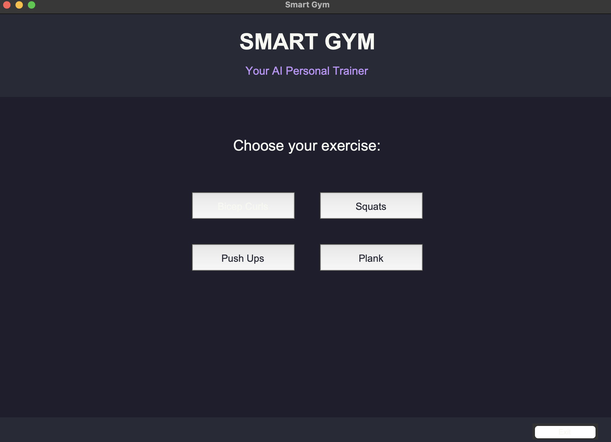
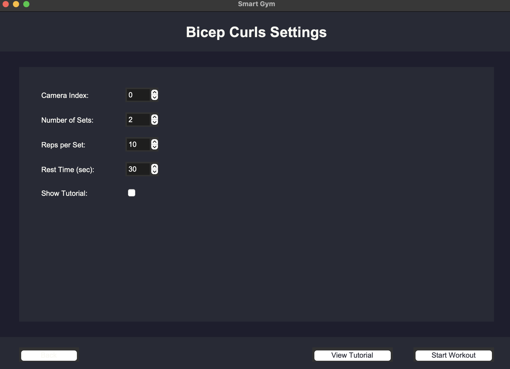
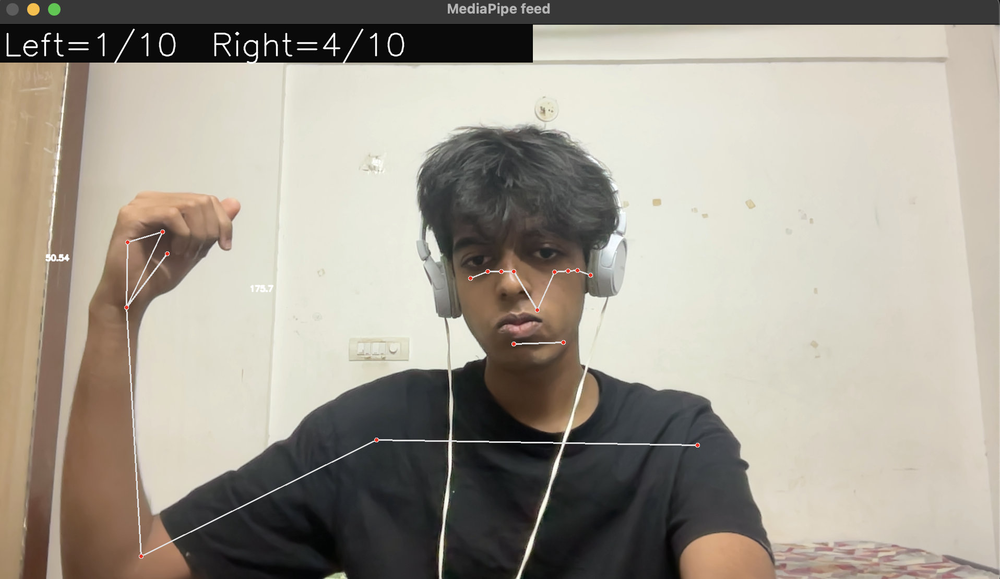

Of course! That's an excellent and very practical piece of information to include for troubleshooting.

Here is the complete, updated `README.md` file with the new note added to the "How to Run" section.

---

# README.md

> **Course:** Smart Product Design  
> **Course Code:** DS2001

# Smart Gym: Your AI Personal Trainer

This project is a computer vision-based prototype designed to address the challenge of making fitness more accessible, intelligent, and portable. It transforms a standard webcam into a personal trainer that can guide users through various exercises, count repetitions, and provide real-time form feedback.

| Main Application Menu                        | Custom Workout Settings                  | Workout Session in Action                  |
| :------------------------------------------- | :--------------------------------------- | :----------------------------------------- |
|                 |         |       |

## Problem Statement

The goal is to develop a "Smart Gym" that brings intelligent and effective workout solutions into the home. Traditional gym memberships can be expensive, and home equipment is often often bulky and lacks guided instruction. This creates a barrier for many people seeking to maintain a healthy lifestyle. Our solution aims to bridge this gap by providing an accessible, data-driven, and interactive fitness experience using just a computer and a webcam.

## Our Solution: A Computer Vision Prototype

We have developed a robust prototype that functions as an AI-powered personal trainer. By leveraging the **MediaPipe** library for real-time pose estimation and **OpenCV** for video processing, our application can:

*   Track the user's body landmarks in real-time.
*   Calculate joint angles to analyze exercise form.
*   Automatically count repetitions for exercises like bicep curls, squats, and push-ups.
*   Time duration-based exercises like the plank.
*   Provide immediate on-screen feedback to help correct the user's form.

The project culminated in a unified application built with **Tkinter**, offering a user-friendly graphical interface to select exercises and configure workouts.

## Key Features

*   **Unified GUI Application**: A central menu to select exercises and customize workouts.
*   **Multiple Exercise Modules**: Includes trackers for Bicep Curls, Squats, Push-Ups, and Planks.
*   **Customizable Workouts**: Users can set the number of sets, reps (or time), and rest periods.
*   **Real-time Pose Estimation**: Uses Google's MediaPipe to accurately track 33 body keypoints.
*   **Automatic Rep Counting & Form Correction**: Intelligently counts reps and provides on-screen alerts for common form mistakes.
*   **Built-in Tutorials**: Each exercise module includes a tutorial screen with instructions and a link to a video guide.
*   **Interactive UI and Overlays**: Custom statistics, progress bars, and feedback are overlaid directly onto the video feed.

## Prerequisites

To run this project, you need Python 3 and the following libraries. You can install them all with a single command:

```bash
pip install opencv-python mediapipe numpy Pillow pyttsx3 cvzone tkinter
```
*(Note: `tkinter` is usually included with standard Python installations.)*

## How to Run the Main Application

The primary entry point for the project is `final.py`, which launches the main GUI.

1.  Make sure all the required libraries are installed.
2.  Ensure you have a working webcam connected to your computer.
3.  Run the following command in your terminal from the project's root directory:
    ```bash
    python final.py
    ```
4.  Use the graphical interface to choose an exercise, adjust your settings, and start your workout!

> ### **Troubleshooting Note**
>
> If you encounter issues with the camera not opening or freezing when using the main application (`final.py`), this can sometimes be caused by conflicts between Tkinter's main loop and OpenCV's video stream.
>
> As a reliable alternative, you can run the **standalone exercise modules directly**. These files are fully-featured and provide the same workout experience without the main GUI.
>
> For example, to start a specific workout, run one of the following commands:
>
> ```bash
> # For Bicep Curls (inside the Pose-Detection folder)
> python Bicep-curl.py
> ```

---

## File Descriptions

The project is composed of several scripts, including a final integrated application and various standalone modules that were developed iteratively.

### Core Application

*   `final.py`
    *   **Purpose**: This is the main, integrated "Smart Gym" application. It provides a user-friendly graphical interface (GUI) built with **Tkinter**.
    *   **Functionality**:
        *   Displays a main menu to select from Bicep Curls, Squats, Push-Ups, or Planks.
        *   Presents a settings screen for each exercise to customize sets, reps/time, and rest periods.
        *   Launches the selected workout in a dedicated OpenCV window.
        *   Integrates the logic for pose detection, rep counting, and form feedback for multiple exercises into a single, cohesive application.
        *   This script represents the final product of the project.

### Standalone Modules with Advanced UI

These scripts are fully functional, standalone applications for specific exercises, featuring polished custom UIs created with OpenCV.

*   `curl_uii.py` (Bicep Curls)
*   `squat_ui.py` (Squats)
*   `pushup_tracker.py` (Push-Ups)
*   `Plank.py` (Plank)
    *   **Purpose**: These files serve as dedicated trainers for their respective exercises.
    *   **Functionality**:
        *   **Settings Menu**: An interactive menu built with OpenCV to configure the workout.
        *   **Tutorial Screen**: Displays instructions and offers a link to a YouTube video tutorial.
        *   **Real-time Feedback**: Provides on-screen stats (reps, sets, time), progress bars, and form correction messages.
        *   **Complete Workout Flow**: Manages the entire session, including countdowns, work periods, rest timers, and a "Workout Complete" screen.

### Developmental & Alternative Modules

These scripts represent the iterative development process, showcasing different approaches and features that were experimented with throughout the project.

*   `app.py`
    *   **Purpose**: An advanced prototype that attempts to **automatically detect** the exercise being performed (Bicep Curl, Squat, or Push-Up) based on joint angle changes, rather than requiring user selection.

*   `squat.py`
    *   **Purpose**: A sophisticated standalone squat analyzer with a unique, clean UI designed to mimic a professional fitness app. It features a `RepCounter` class for more robust rep detection.

*   `Downward-facing-dog.py`
    *   **Purpose**: A specialized yoga pose detector for the "Downward-Facing Dog" position.
    *   **Unique Feature**: It uses the `pyttsx3` library to provide **voice feedback** ("Correct" or "Incorrect"), demonstrating an alternative feedback mechanism.

*   `Bicep-curl.py` / `mod_curl.py` / `more_mod.py` / `curl2.py`
    *   **Purpose**: A collection of scripts representing the evolution of the bicep curl tracker. They start with basic counting and progressively add features like dual-arm tracking, target reps from command-line input, and pre-workout countdowns.

*   `squat_tracker.py`
    *   **Purpose**: A simpler, command-line-driven squat tracker. It takes user input for sets and reps from the terminal and provides a basic OpenCV window for tracking.

*   `Push-up.py`
    *   **Purpose**: A basic push-up counter. It uses the `festival` text-to-speech engine (common on Linux) for audio feedback on rep counts.

*   `curl.py`
    *   **Purpose**: One of the earliest and most fundamental scripts. It performs basic, single-arm bicep curl counting, serving as the foundation for more advanced versions.

### Utility & Exploratory Scripts

These files were used for initial testing of core technologies.

*   `face_detect.py`
    *   **Purpose**: A simple script to test basic OpenCV functionality. It uses Haar Cascades, a classic CV technique, to detect faces in a webcam feed.

*   `pose-detection.py`
    *   **Purpose**: An exploratory script that uses the `cvzone` library (a wrapper for MediaPipe) to perform pose detection. This was likely used to compare different libraries and approaches.

## Future Work

*   **Add More Exercises**: Expand the library to include exercises like lunges, overhead presses, and jumping jacks.
*   **Machine Learning for Form Analysis**: Train a custom machine learning model to provide more nuanced and accurate form feedback.
*   **User Profiles**: Implement a system to save user data, track progress over time, and create personalized workout plans.
*   **Gamification**: Add points, achievements, and leaderboards to make workouts more engaging.
